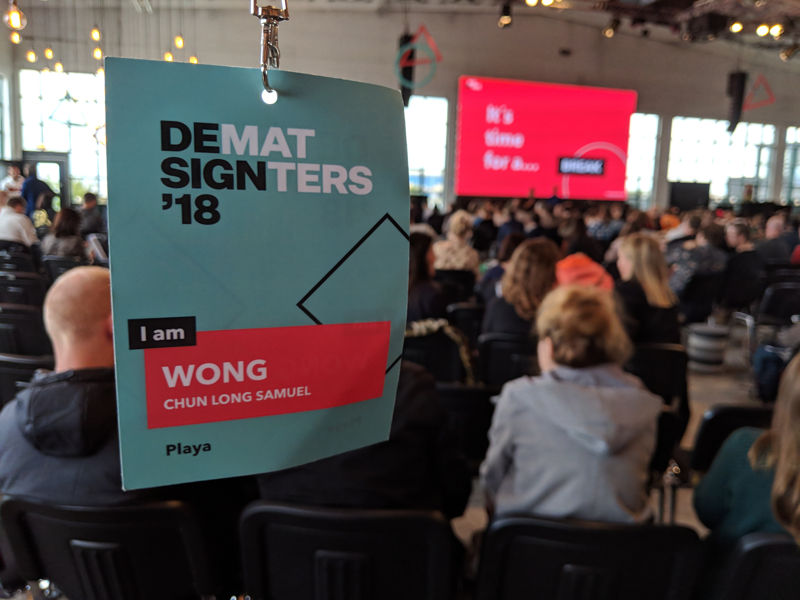
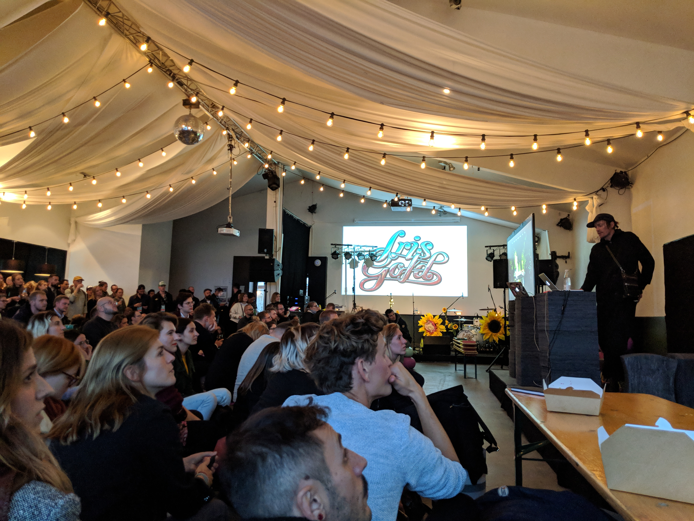

---

path: "/journey-to-design-matters"

date: "2018-09-29"

title: "Journey to Design Matters"

tags: ["Design", "Conference", "DesignMatters18" ]

image: "./IMG_20180927_145719.jpg"

---

It was a truly enlightening trip to Denmark, attending Design Matters 2018 in Copenhagen (Sep 26 -27, 2018). Not only are the talks and workshops given by design practitioners across the industry illuminating, it had also made me take a step back to reflect on the whole workflow of design process.

##Design for feelings

One of the recurring theme during this year conference, is the re-discovery of emotional design. Few speakers’ keynote coincidentally brought up the importance of expressive design, while utilitarian and minimal design has been dominated by industry leaders like Apple and Google. Tobias Ahlin from Minecraft stressed on the building emotionally engaging design style, that would eventually craft a distinctive voice for the brand. 

The question, “What are the key moments how your user feel” should also be addressed during the design process, aside from the quantitive approach, especially feelings are not measurable from data analysis. 

##Become a hybrid designer

</img>
</img>

Joining over 900 designers around the world, I’m also excited signing up two workshops, which were equally  fun and inspiring, including "Game Design" workshop hosted by Dori Adar (Hands on Games) and "New Hybrid Designer" facilitated by McKinsey Design. 

One reason why I chose these two workshops was to getting myself familiar with new aspect of the design, by introducing gamification to the design process and also talking about the business value of it.

Becoming a hybrid designer has become more true in current days, in a sense that multi-discipline designers would be more communicative to make pragmatic and sensible design choice. 

##Takeaways 

 

Making design happens takes more than a person or designers to be involved. Design values that we should uphold, mindset of management and clients are also equally important in the design process to make it work. 

After Intensive talks and workshops for two full-days. This trip has been rewarding for myself to take a look at my own approach and position. Taking a step back to see the bigger picture would make the journey of design come clear. 
