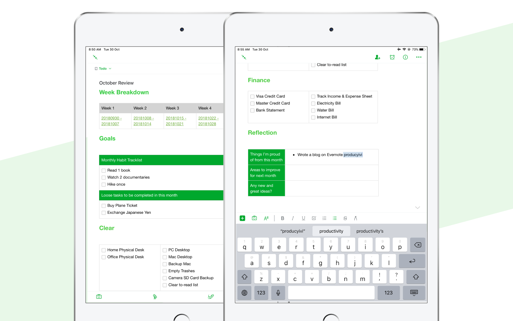
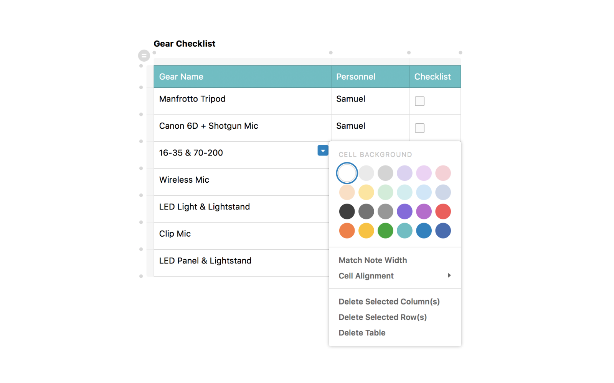
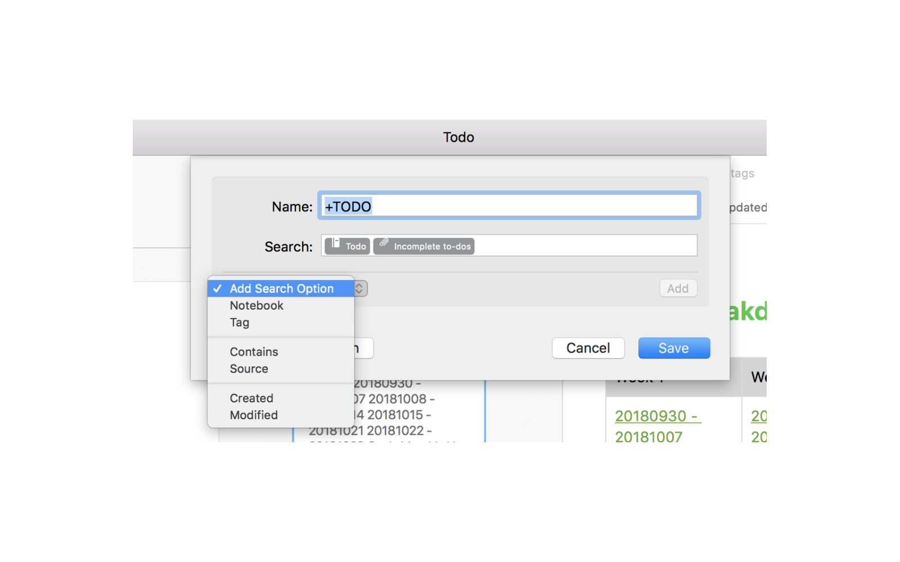
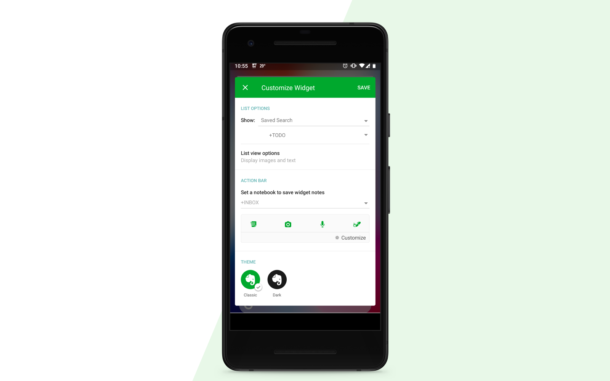

---

path: "/practical-evernote-tips"

date: "2018-10-29"

title: "Practical Tips on Evernote"

tags: ["Evernote", "Productivity" ]

image: "./Evernote.png"

---

TLDR: Practical Evernote tips that help you to build your own knowledge base and get things done (GTD)

I have been a long-time user of Evernote but I have only been subscribed to their paid plans until recently, which is why I totally understand the challenges that Evernote is facing. Not only there has been a recent shakedown in Evernote's management team, but I also worry about the platform's future. 

Serious competitors like [Bear](https://itunes.apple.com/us/app/bear/id1016366447?mt=8) and [Notion](https://www.notion.so/?r=03ba56842b4b42a2916de481e0aa9754) took on new approaches to the note-taking field, Notion is more versatile in collaboration, especially in project and data management, while Bear offer more pleasant user experience exclusively on Apple ecosystem. Evernote, on the other hand, has yet to give us a glimpse of the future of note-taking. 

With the brand revamp last month and foreseeable major app revamp upcoming. Let’s take a look at the existing Evernote and introduce a few tips that I’ve recently discovered.

## Better to be late than sorry: **Templates**

Templates should have been on Evernote since it was ever released. Before that, I always had a template tag with all the reusable documents. But it's better to be late than sorry. Templates might not be very useful for long-time pro users since I assume most of them developed their own workflow already. But it is always nice to check out how do other people work, it would be even better if people can submit and share their own template. At least you can do it in your notebook, by clicking "Save as Template" in context menu next to the title. 

## **Tables has been revamped**

My impression of the old Evernote tables was always lack of style and function. It was a pure html table without much formatting options.

New table features revamped a year ago, but I have discovered only recently. Supporting drag-and-drop rows and intuitive controls allow my notes become more systematic. Usually, I use table as a header template for document type, like meeting notes and agendas. It is much easier than writing on a completely blank note. 

## **To-do List + Saved Search with Filters**

Most people used Todoist or Wunderlist or Things for task management. But practicing bullet journals since last year has made me realized it is more important to be engaged with the task in time than tools itself. The essence and also the beauty of Bullet Journal system is a fresh start every day and copying unresolved tasks manually to remind yourself.  

Using Evernote as a to-do list might not be your obvious choice, but it's worth exploring as an alternative option. Typing [ ] on keyboard anywhere would convert into an interactive checkbox. And the best part is the advanced filtering. 

Evernote's saved search feature (also could be queried like a notebook) allows users to filter notes. In my case, I created a filter in my todo notebook, that will show all notes with unchecked boxes. This has become my main task list. Since I would cross-out checkbox even if I haven't finished the task, this to-do filter will automatically display my daily tasks and monthly tasks. 

Check out this official guide on how to create saved search [https://help.evernote.com/hc/en-us/articles/209005267-How-to-create-a-saved-search](https://help.evernote.com/hc/en-us/articles/209005267-How-to-create-a-saved-search). 

## Full Customizable Widgets (Android Only)

I love Evernote's Android widget that everything is customizable. You can query the notes to show on the widget, arrange the order of action bar icons and even which notebook are those quick notes are saving to. 

This kind of flexibility allows me to turn my Android widget into an inbox of my inspiration and to-do items.  All new ideas and tasks are entered on the go. 

## Masonry Grid View (Windows Only)

It is weird that Evernote has actually built a Masonry Grid View (It's called Thumbnail View), but the feature is only limited to Windows Evernote.  This feature is useful for designers who want to collect visual graphics within a notebook. You can even control the numbers of columns you want to show in the grid.

## Last Words

In the meantime, I'm also experimenting other note-taking tools especially the idea of building a personal knowledge base has become more popular in this field. Suggest your favourite Evernote hack / tips and share with me on [Twitter](http://twitter.com/desktopofsamuel) / [Medium](http://medium.com/@desktopofsamuel)
