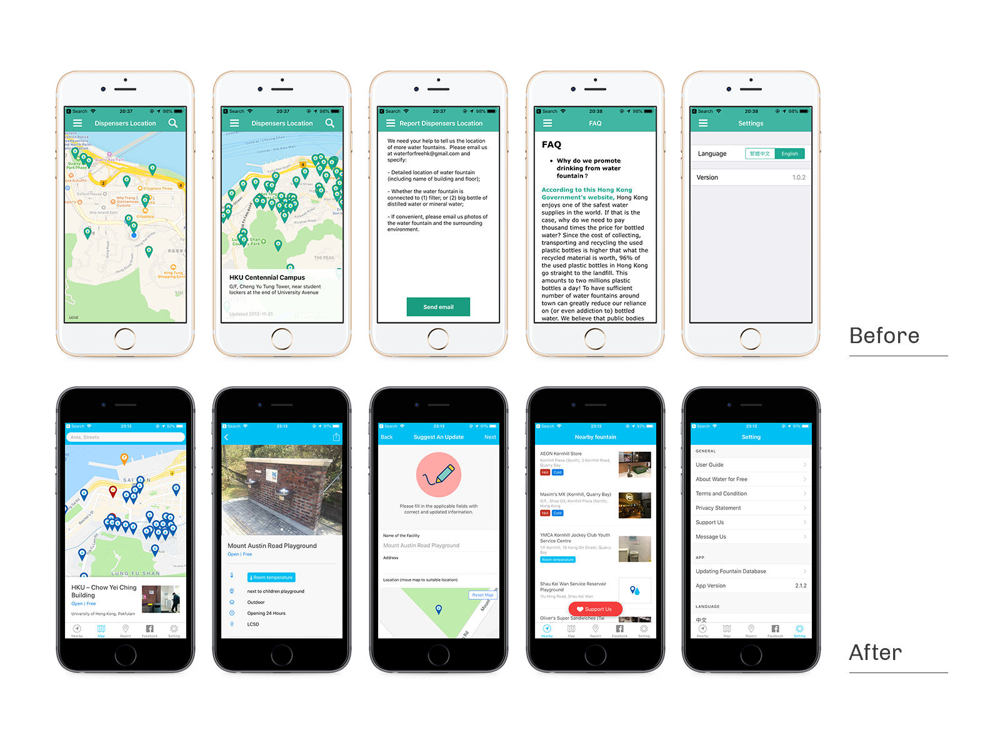
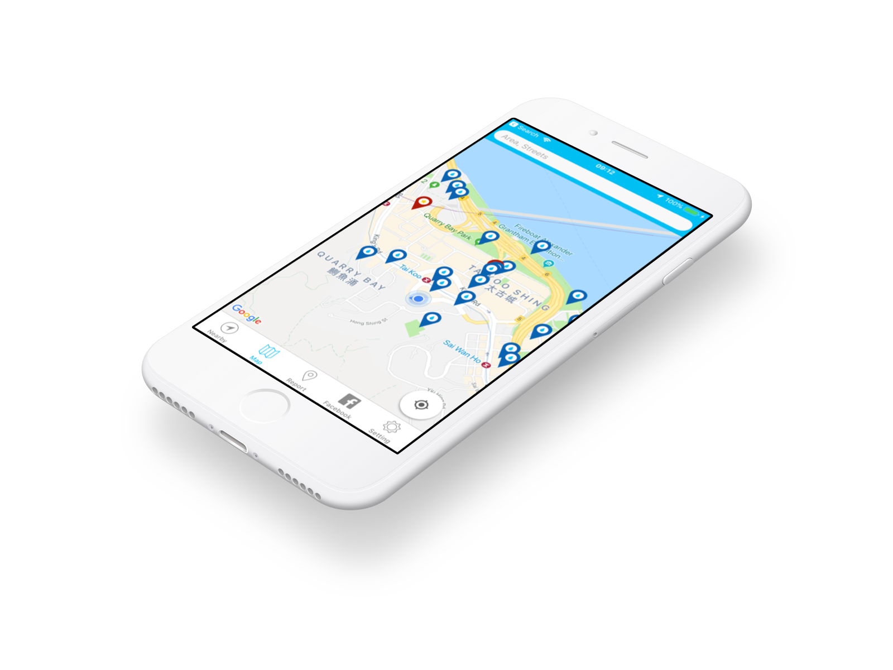

##Water For Free

Water for Free is a mobile app that shows over 1600 locations of water dispensers in Hong Kong and Macau. It is an effort to reduce the vast amounts single-use beverage containers entering our landfills and oceans everyday.

Playa has taken the job for revamping the app and content management system. I have participated in the project as project manager and product designer in 2017. Primary objective of the project is to expand on the water dispenser database with more metadata, e.g. opening hours, photos and water temperature. New dispenser page also include Google Map integration and suggest feature on revising the database.

Since the revamp app launch in 2017 July. More than 30,000 downloads have been achieved across iOS and Android. App Store has also featured the app in “New Apps We Like” during launch, later in “World Water Day” and “Pedal-powered fun” collections.

